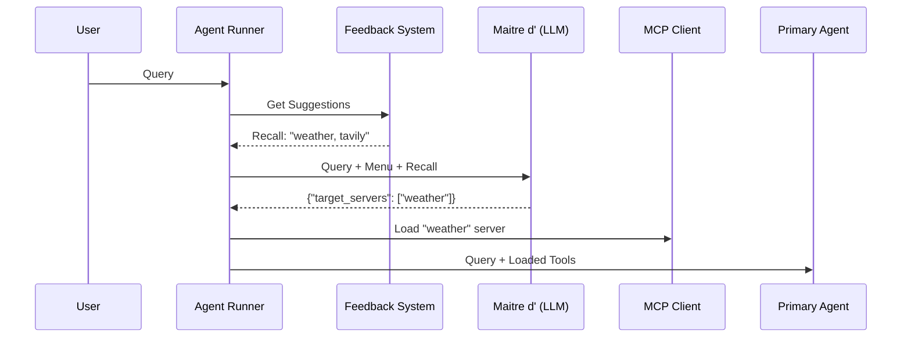

# Maître d' System (Tool Selection Engine)

The **Maître d'** (Feature 9) is an intelligent tool selection and intent classification engine within the Agent Runner. Its primary purpose is to reduce LLM context clutter and improve reasoning accuracy by dynamically loading only the tools relevant to a user's query.

## Core Problem

With dozens of available Model Context Protocol (MCP) servers, passing all tools to an LLM for every query causes:
1.  **Context Bloat**: Wastes tokens and increases latency.
2.  **Reasoning Errors**: The LLM gets confused by too many choices.
3.  **Security Risk**: Unnecessary exposure of tools to the model.

## Component Overview

The Maître d' operates in three distinct phases:

### 1. Tool Menu Discovery
During system startup and periodic refreshes, the `AgentEngine` scans all configured MCP servers to build a `tool_menu_summary`. This menu acts as the "Discretionary List" of tools available to the system.

### 2. Intent Classification
When a query arrives, the `_classify_search_intent` function (the Maître d' itself) is invoked:
- **Fast Judge Model**: Uses a lightweight model (e.g., `gpt-4o-mini` or `llama3.3-70b`) to analyze the query.
- **Selection**: It matches the query against the "Menu" and returns a list of `target_servers`.
- **Core Tools**: Essential tools like `Memory`, `Time`, and `Thinking` are **always** loaded and bypass classification.

### 3. The Learning Loop (Feedback System)
The system "learns" from successful interactions via `agent_runner/feedback.py`:
- **Recording**: When an agent successfully uses a tool to answer a query, `record_tool_success` is called.
- **Recall**: For future queries, `get_suggested_servers` performs a keyword/semantic match against successful history.
- **Dynamic Injection**: These suggestions are injected into the Maître d' prompt as "Recall" hints, significantly improving selection accuracy for recurring tasks.

## Technical Details

### API Endpoint
The Maître d' classifies queries using the standard OpenAI-compatible chat completion format:
- **Server**: Agent Gateway (Port 5455 by default)
- **Response Format**: `json_object`

### Data Flow

## Configuration
The Maître d' logic is primarily controlled by the `agent_model` setting in `system_config.json`. It is designed to "fail open"—if classification fails or times out, the system loads a safe default set of tools to ensure the user's query can still be processed.
