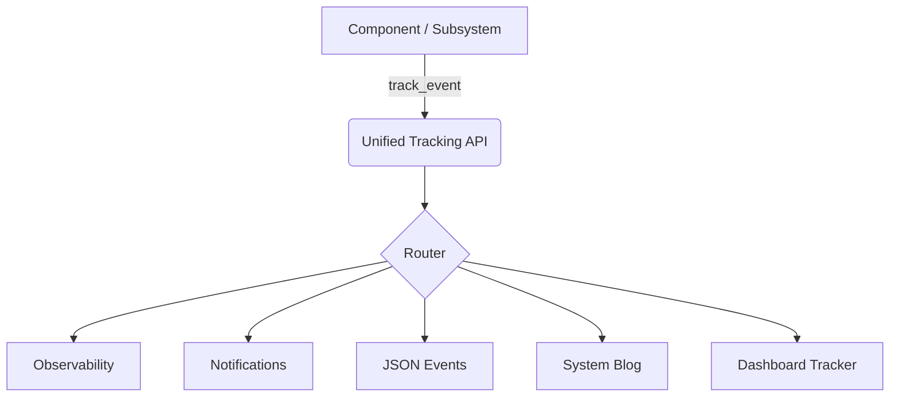

# Unified Tracking Layer

The Unified Tracking Layer (`common/unified_tracking.py`) provides a single, high-level API for all event tracking, error reporting, and system blogging within the AI Orchestrator. It eliminates silos by automatically routing events to multiple downstream systems based on their category and severity.

## Architecture

The system uses a "Fan-Out" pattern where a single call to `track_event` distributes information to:

1.  **Observability System**: Performance metrics, request tracking, and detailed traces.
2.  **Notification System**: Real-time alerts (Pushover/Local) for high-severity events.
3.  **JSON Event Logging**: Structured logs stored for automated analysis and chaos reporting.
4.  **System Blog**: Human-readable summaries of system state and significant transitions.
5.  **Dashboard Tracker**: Error reporting and connectivity status for the Antigravity dashboard.



## Key Benefits

- **Single Entry Point**: Developers don't need to know which systems to call for different event types.
- **Consistent Metadata**: Ensures events have standardized timestamps, request IDs, and component tags.
- **Resilience**: If one downstream system (e.g., Notifications) is offline, the tracker continues to log to others.
- **Lazy Initialization**: Minimal overhead; downstream systems are only loaded when needed.

## Usage Guide

### Recommended Patterns

Always prefer the convenience functions for common event types:

```python
from common.unified_tracking import (
    track_error,
    track_health_event,
    track_mcp_event,
    track_dashboard_event,
    EventSeverity
)

# Track a critical error
track_error(
    event="database_connection_lost",
    message="SurrealDB unreachable at 127.0.0.1:8000",
    error=e,
    component="memory_server",
    severity=EventSeverity.CRITICAL
)

# Track an MCP server event
track_mcp_event(
    event="mcp_server_restarted",
    message="Weather server restarted by watchdog",
    server="weather",
    severity=EventSeverity.INFO
)
```

### Event Categories and Severities

| Severity | Routing Logic |
| :--- | :--- |
| **CRITICAL** | All systems + Notifications (Immediate) |
| **HIGH** | All systems + Notifications |
| **MEDIUM** | Logs, Blog, Dashboard, Observability |
| **INFO** | Logs, Blog, Observability |
| **DEBUG** | Logs, Observability |

## Migration Status

As of Jan 2026, the migration is **Complete**. 

- Core systems (Agent Runner, Router, RAG) use the unified API.
- Legacy direct calls to `notify_user` or the dashboard tracker are deprecated.
- **Circuit Breakers**: MCP circuit breakers are fully integrated with the tracking layer.
